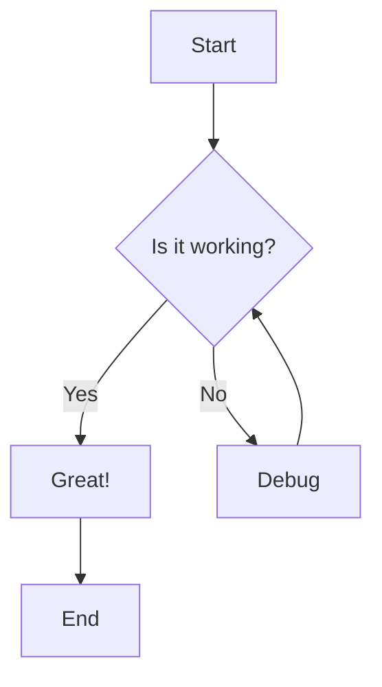
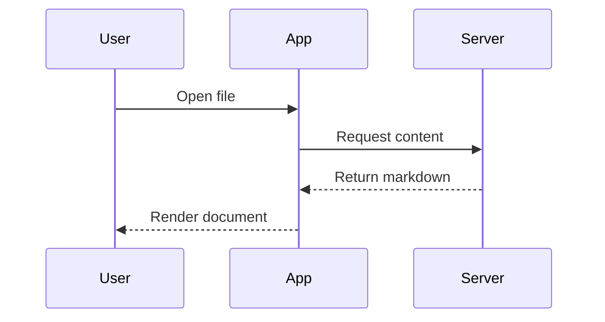
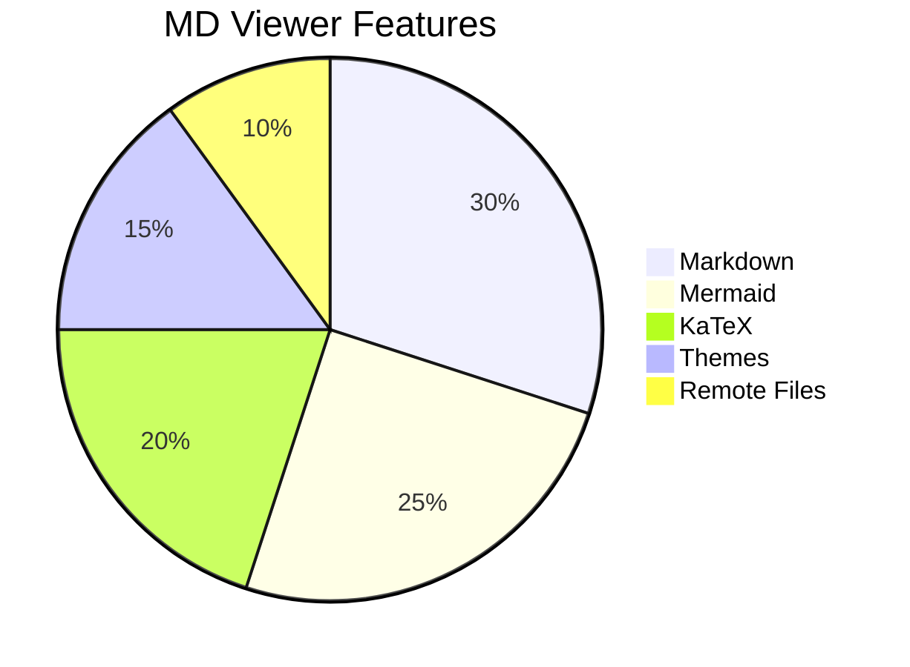
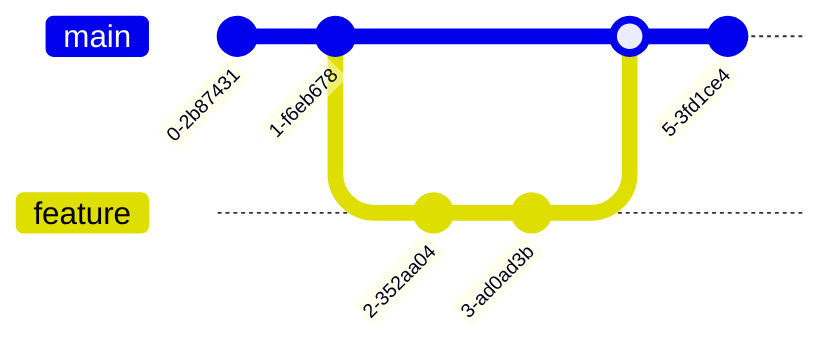

# MD Viewer

A minimalist markdown viewer with support for GitHub Flavored Markdown, Mermaid diagrams, syntax highlighting, and LaTeX math.

## How to Load Files

### Docs Folder
Place markdown files in the `docs/` folder - they'll appear in the "Docs Folder" section on the welcome screen.

```bash
# Copy a file to the docs folder
cp /path/to/your/file.md /path/to/md-viewer/docs/
```

### Drag & Drop
Drag any `.md` file from your file manager onto the browser window.

### Remote File (Ctrl+Shift+O)
Opens a dialog to connect via SSH/SFTP, SMB, or NFS to fetch files from remote servers.

### Direct API URL
For files in the docs folder, link directly:
```
https://example.com/api/file?path=filename.md
```

---

## Text Formatting

This is **bold text** and this is *italic text*. You can also use ~~strikethrough~~.

Here's some `inline code` in a sentence.

## Headings

### H3 Heading
#### H4 Heading
##### H5 Heading
###### H6 Heading

## Links

- [External Link](https://example.com)
- [Relative Link](./mermaid.md)
- [Anchor Link](#text-formatting)
- Email: <mailto:test@example.com>

## Lists

### Unordered List
- Item 1
- Item 2
  - Nested item 2.1
  - Nested item 2.2
- Item 3

### Ordered List
1. First item
2. Second item
   1. Nested item 2.1
   2. Nested item 2.2
3. Third item

### Task List
- [x] Completed task
- [ ] Incomplete task
- [x] Another completed task

## Code Blocks

```javascript
function hello(name) {
  console.log(`Hello, ${name}!`);
  return true;
}

hello('World');
```

```python
def fibonacci(n):
    if n <= 1:
        return n
    return fibonacci(n-1) + fibonacci(n-2)

print(fibonacci(10))
```

```bash
#!/bin/bash
echo "Hello from bash!"
ls -la
```

## Blockquotes

> This is a blockquote.
> It can span multiple lines.
>
> > Nested blockquote.

## Tables

| Feature | Status | Notes |
|---------|--------|-------|
| Markdown | Done | GFM support |
| Mermaid | Done | All diagram types |
| KaTeX | Done | Math rendering |
| Themes | Done | Light/Dark/System |

## Math

Inline math: $E = mc^2$

Block math:

$$
\frac{-b \pm \sqrt{b^2 - 4ac}}{2a}
$$

$$
\int_{-\infty}^{\infty} e^{-x^2} dx = \sqrt{\pi}
$$

## Mermaid Diagrams

### Flowchart



### Sequence Diagram



### Pie Chart



### Git Graph



## Horizontal Rule

---

## Images


## Special Characters

- Quotes: "double" and 'single'
- Dashes: em—dash and en–dash
- Ellipsis: ...
- Arrows: -> <- <-> => <=
- Special: (c) (r) (tm)

## Footnotes

This is a sentence with a footnote.[^1]

[^1]: This is the footnote content.

## Definition Lists

Term 1
: Definition 1

Term 2
: Definition 2a
: Definition 2b

## Emojis

Some emojis: 👍 🎉 🚀 ✅ ❌

## Long Content for Scroll Testing

Lorem ipsum dolor sit amet, consectetur adipiscing elit. Sed do eiusmod tempor incididunt ut labore et dolore magna aliqua. Ut enim ad minim veniam, quis nostrud exercitation ullamco laboris.

Duis aute irure dolor in reprehenderit in voluptate velit esse cillum dolore eu fugiat nulla pariatur. Excepteur sint occaecat cupidatat non proident, sunt in culpa qui officia deserunt mollit anim id est laborum.

Curabitur pretium tincidunt lacus. Nulla gravida orci a odio. Nullam varius, turpis et commodo pharetra, est eros bibendum elit, nec luctus magna felis sollicitudin mauris.

Integer in mauris eu nibh euismod gravida. Duis ac tellus et risus vulputate vehicula. Donec lobortis risus a elit. Etiam tempor. Ut ullamcorper, ligula eu tempor congue, eros est euismod turpis, id tincidunt sapien risus a quam.
