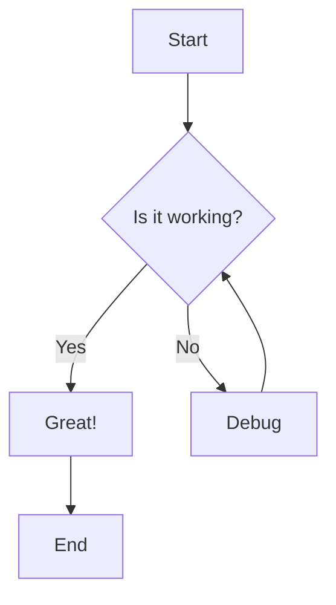
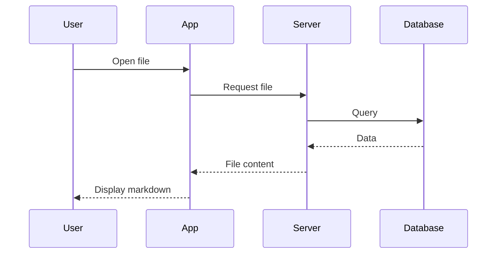
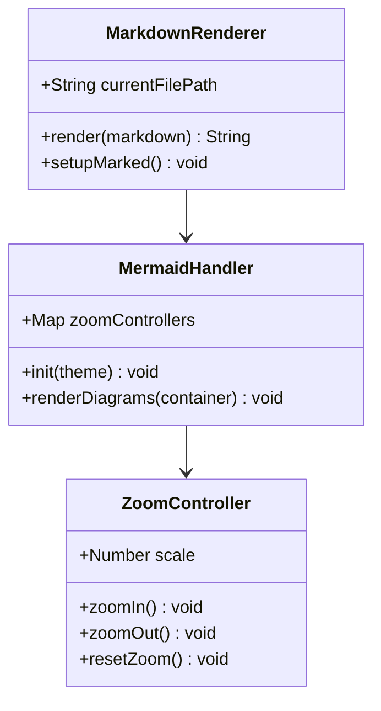
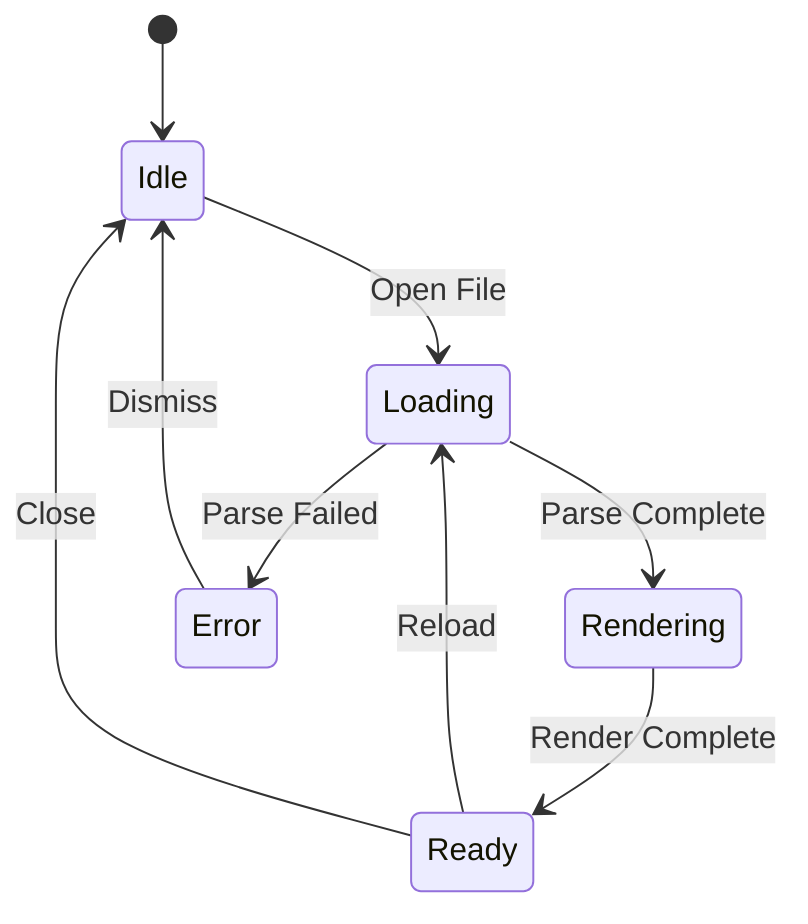
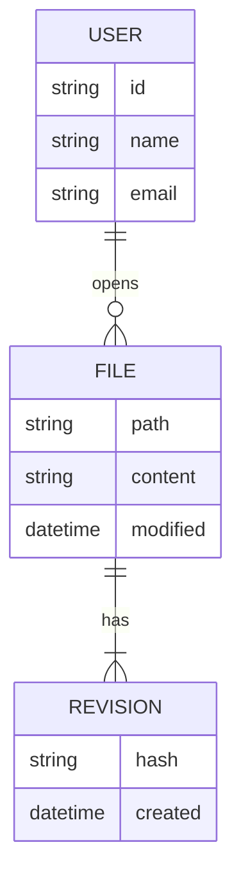
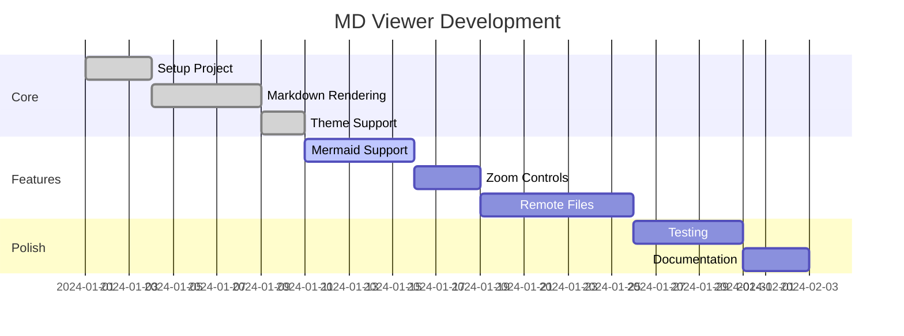
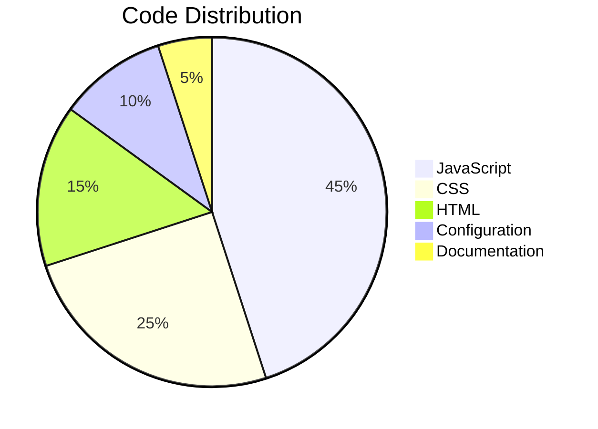
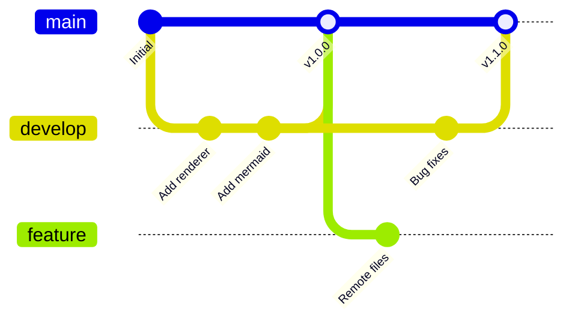
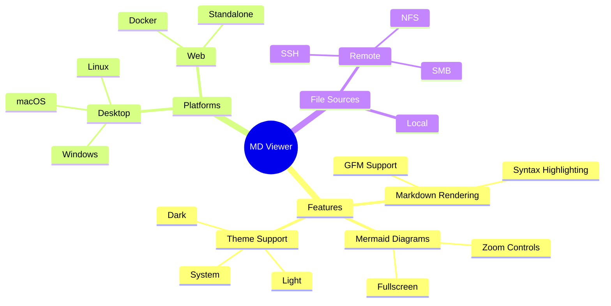
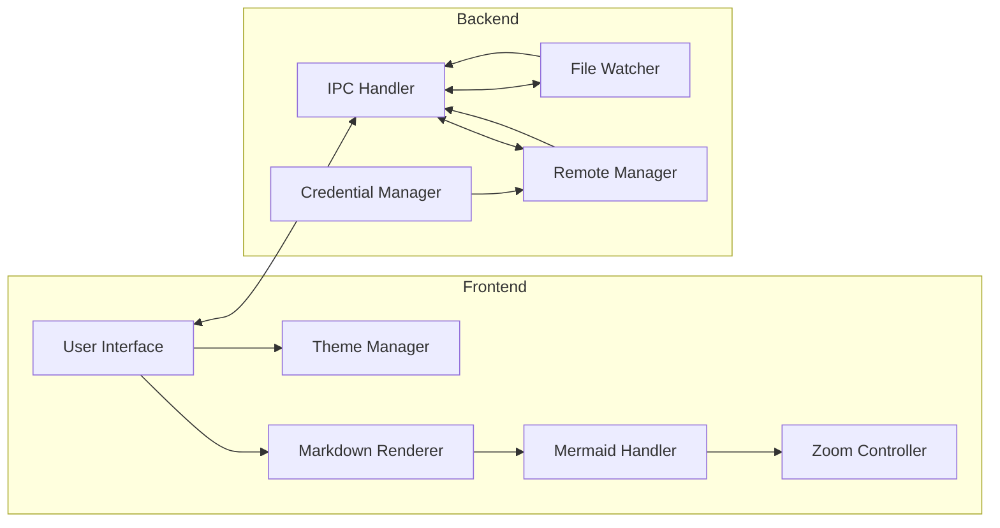

# Mermaid Diagram Tests

This file tests all supported Mermaid diagram types.

## Flowchart



## Sequence Diagram



## Class Diagram



## State Diagram



## Entity Relationship Diagram



## Gantt Chart



## Pie Chart



## Git Graph



## Mindmap



## Syntax Error Test

This diagram has a syntax error and should display an error message:

```mermaid
flowchart TD
    This is not valid mermaid syntax
    A --> B --> --> C
```

## Complex Flowchart


